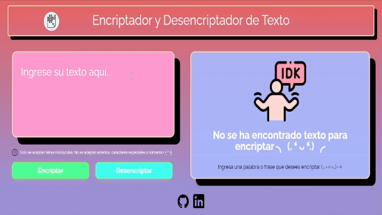
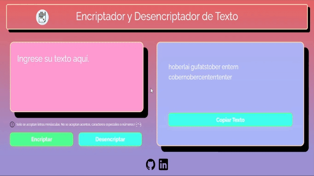
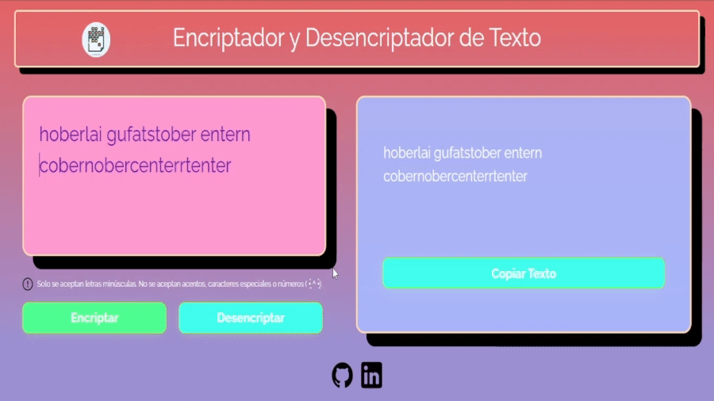
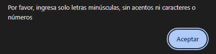

<h1> Challenge Alura-ONE: Encriptador de texto </h1>

## Descripción del Challenge

El proyecto consiste en una aplicación web que a a los usuarios encriptar y desencriptar mensajes de manera sencilla y divertida. Utiliza un método de encriptación basado en reglas simples para transformar el texto ingresado en un código secreto y viceversa.

## Caracteristícas

- **Encriptación y Desencriptación:** La aplicación utiliza un conjunto específico de reglas para convertir las letras del texto en un código secreto y proporciona la capacidad de revertir este proceso para recuperar el mensaje original.
- **Interfaz Amigable:** La página web ofrece una interfaz intuitiva con campos claros para ingresar el texto a encriptar o desencriptar.
- **Copiar Texto:** Se incluye un botón que permite copiar fácilmente el texto encriptado o desencriptado al portapapeles del usuario, simplificando así su uso y compartición.
- **Validación de Entrada:** Se garantiza que solo se utilicen letras minúsculas del alfabeto en el texto ingresado, excluyendo letras con acentos y caracteres especiales.

## Limitaciones

- Solo es posible encriptar texto en letras minúsculas, no se pueden utilizar letras con acentos ni caracteres especiales, ni tampoco números.

## Cómo Usar

- **Ingresar Texto:** En la página principal, encontrarás un campo designado para ingresar texto.
- **Seleccionar Opción:** Elige si deseas encriptar o desencriptar el texto utilizando los botones correspondientes.
- **Visualizar Resultado:** El resultado se mostrará automáticamente en un campo designado después de hacer clic en el botón correspondiente.
- **Copiar Texto (Opcional):** Si deseas copiar el texto encriptado o desencriptado, simplemente haz clic en el botón "Copiar" para transferirlo al portapapeles.

Puedes probar el encriptador desde [aqui]()

## Interfaz y funcionamiento.
**Encriptación de Texto**

**Función Copiar Texto**

**Desencriptación de Texto**

**Advertencia de caracteres no validos**

## Acerca de

Este proyecto fue desarrollado como parte de un desafío técnico y está disponible para su uso gratuito.

